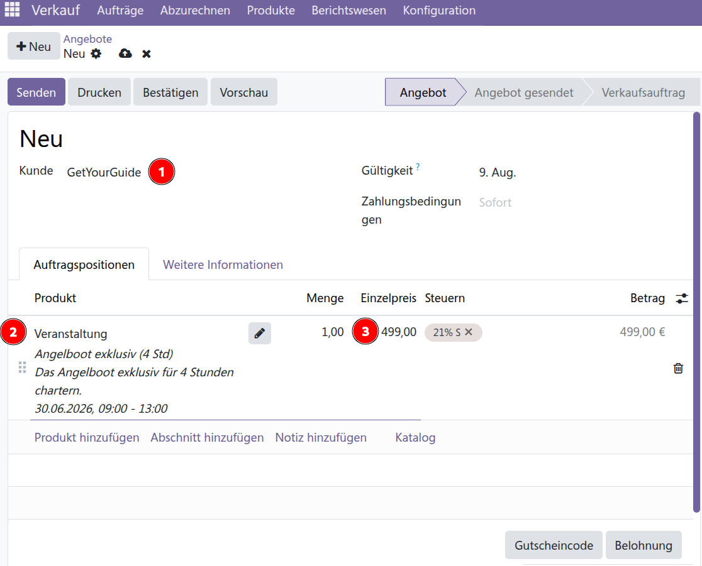
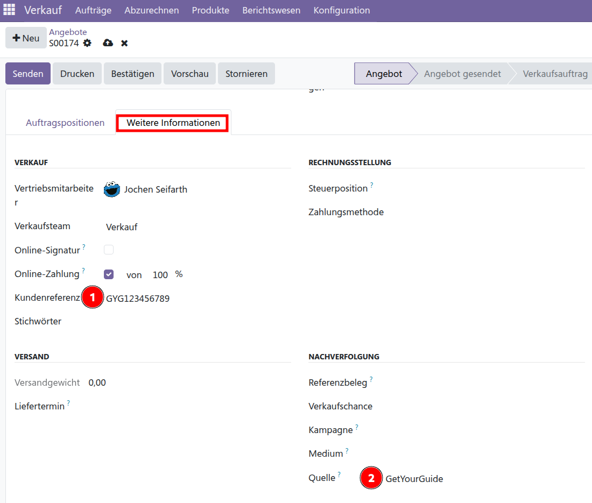
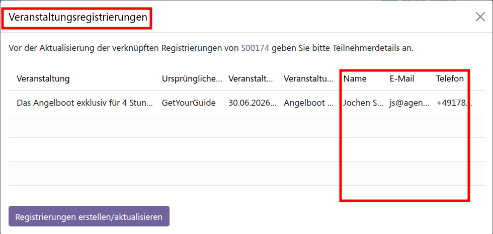
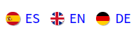
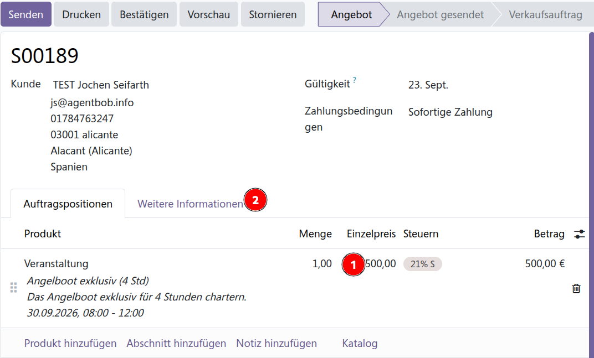
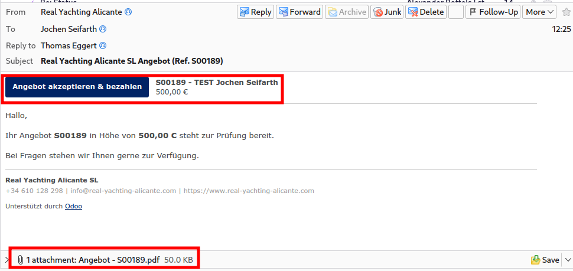
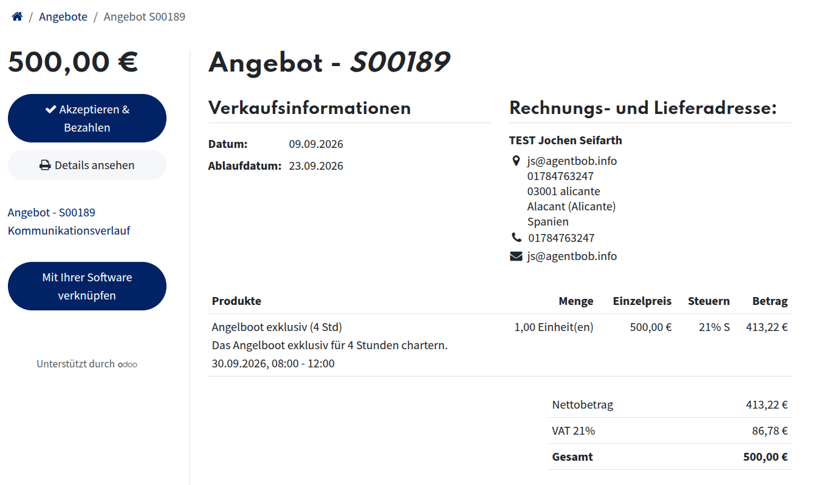

# Buchungen

## Plattformen: Kunde zahlt komplett und nur an Plattform
#### Beispiele
- GetYourGuide
- Segelreisen Hering
- Click&Boat
- SamBoat

Unsere Rechnung geht an die Plattform als Kunde - **nicht** an Teilnehmer. Die Teilnehmer bekommen von uns nur Tickets.

#### Auslöser
Email mit Buchungsdaten kommt.

### Vorgehen
+ In Odoo als Benutzer anmelden, Menü [Verkauf](https://real-yachting-alicante.com/odoo/sales)
+ Auf **\[+Neu]** klicken um einen Verkaufsauftrag zu erstellen:

1. **Kunde** ist immer GetYourGuide bzw. die Platform
2. Veranstaltung, Zeitfenster und Anzahl Tickets auswählen
3. ggf. Preis überschreiben
4. auf Tab "Weitere Informationen" erfassen:
    

1. Kundenreferenz: GYG????????? - die Auftragsnummer der Platform
2. Quelle: "GetYourGuide" bzw. die Platform auswählen

Verkaufsauftrag **\[Bestätigen]** klicken

im Popup

- **Teilnehmer**-Namen, -E-Mail und -Telefon eintragen
- **\[Registrierungen_erstellen/aktualisieren]**  klicken
  
!!! warning "Teilnehmer erhält automatisch Tickets (Achtung: Email ist in der Sprache des aktuell angemeldeten Benutzers! - solange der Kunde (die Platform) keine Sprache voreingestellt hat). Das Zeitfenster der Veranstaltung ist damit belegt und kann nicht mehr von anderen gebucht werden."

Verkaufsauftrag **\[Rechnung erstellen]** klicken, "reguläre Rechnung" auswählen, ggf. Fälligkeitsdatum anpassen, **\[Bestätigen]** klicken

Bei Zahlungseingang von der Platform die Rechnung mit **\[Zahlen]** als bezahlt markieren

## Plattformen: Kunde zahlt nur Provision an Plattform und an uns den Rest
#### Beispiele
- FishingBooker

**Rechnung** über den Restbetrag (also ohne Provision) und **Tickets** gehen an **Kunde/Teilnehmer**

#### Auslöser

Email mit Buchungsdaten kommt.

### Vorgehen
Anonym die Website aufrufen. Mit diesen Links wird man automatisch anonym und die Quelle wird automatisch richtig erfasst.

- [https://www.fishing-alicante.com/web/session/logout?redirect=/event&utm_source=**FishingBooker**](https://www.fishing-alicante.com/web/session/logout?redirect=/event&utm_source=FishingBooker)

Sprache **des Kunden** auswählen 

Veranstaltung auswählen, **\[Buchen]** klicken, Datum auswählen, Ticket(s) auswählen, Teilnehmer-Name, -Email, -Telefon ausfüllen,  **\[Zur Zahlung]** klicken

Rechnungsadresse ausfüllen, **\[Bestätigen]** klicken
!!! info "Wenn keine postalische Adresse vorliegt: Email und/oder Telefon-Nummer als Straße verwenden und als Stadt 03001 Alicante, Spanien"

Damit ist die Auftragserfassung abgeschlossen, jetzt in Odoo als regulärer Benutzer anmelden, [Menü Verkauf](https://www.real-yachting-alicante.com/odoo/sales)

Die eben erfasste Buching sollte der oberste Verkaufsauftrag sein, diesen aufrufen. (Optional: Durch Klick auf den  Kundennamen die Kundendetails aufrufen und die Sprache überprüfen, es sollte die oben ausgewählte sein)

1. Preis überschreiben
2. auf Tab "Weitere Informationen" erfassen: Kundenreferenz: FB?????????, Quelle sollte schon ausgefüllt sein

**\[Senden]** klicken, ggf. Email Text im Popup modifizieren und **\[Senden]** klicken, dann wird das Angebot per Email verschickt.

In der Email hat der Kunde einen Button **\[Angebot akzeptieren & bezahlen]** womit er immer und ohne spezielle Anmeldung auf folgende Bezahlseite kommt:

!!!warning "Erst bei Bezahlung wird der Platz für die Veranstaltung reserviert und das Ticket sowie Rechnungen verschickt, das passiert alles automatisch und in der oben ausgewählten Sprache des Kunden."
