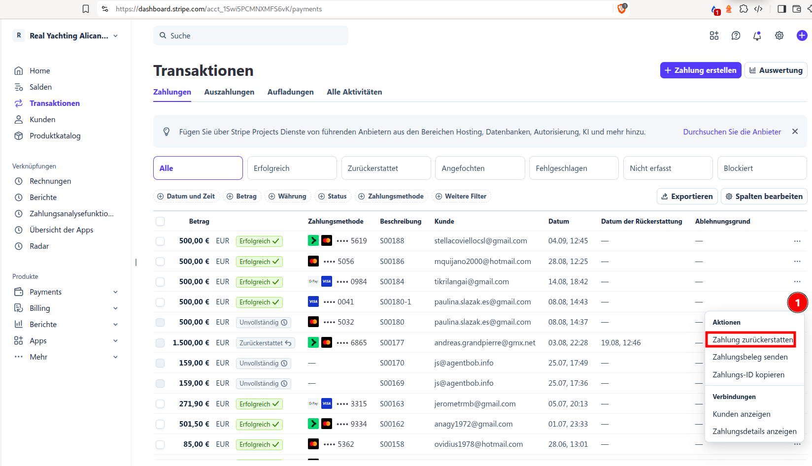

# Storno

#### Auslöser
Email mit Storno kommt.

### Vorgehen
+ In Odoo als Benutzer anmelden

+ Menü [Verkauf](https://real-yachting-alicante.com/odoo/sales)

Verkaufsauftrag auswählen - mit GYG??????? suchen / ggf. Feld Kundenreferenz einblenden um richtigen Auftrag zu identifizieren

!!! info "Direktbucher bzw. Kunden über Plattformen die direkt bei uns bezahlen haben am Verkaufsauftrag erst dann eine Rechnung wenn sie bezahlt haben"

#### Wenn die Rechnung am Verkaufsauftrag noch nicht bezahlt wurde bzw. keine vorhanden ist
Am Verkaufsauftrag **\[Stornieren]** klicken --> Veranstaltung(-szeitfenster) ist automatisch wieder freigegeben sodass anderen buchen können

#### Kunden (Direktbucher) die über Stripe bezahlt haben
Zahlung in Stripe zurückerstatten über
[https://dashboard.stripe.com/acct_1Swi5PCMNXMFS6vK/payments](https://dashboard.stripe.com/acct_1Swi5PCMNXMFS6vK/payments)

!!! danger "In Odoo einen Vermerk über die Rückerstattung machen."

Am Verkaufsauftrag auf Box Rechnungen klicken und zugehörige Rechnung **\[Auf Entwurf zurücksetzen]** 

Am Verkaufsauftrag **\[Stornieren]** klicken --> Veranstaltung(-szeitfenster) ist automatisch wieder freigegeben sodass andere buchen können

#### Wenn (Teil-)beträge von Rechnungen schon bezahlt wurden
Dann wird die  beliebig komplex abhängig von der genauen Konstellation, Zahl- und Erstattungsweg

